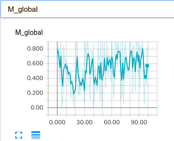
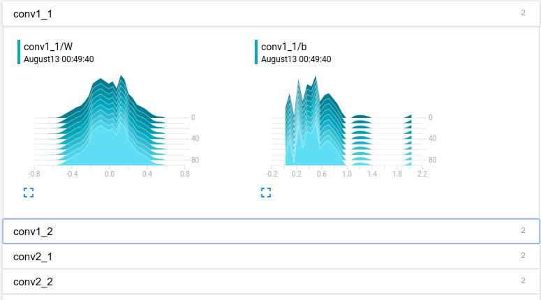
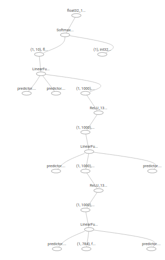

# tensorboard-chainer

Write tensorboard events with simple command.
including scalar, image, histogram, audio, text, graph and embedding.

This is based on [tensorboard-pytorch](https://github.com/lanpa/tensorboard-pytorch).

## Scalar example

## Histogram example

## Graph example

## Reference

* https://github.com/lanpa/tensorboard-pytorch
* https://github.com/TeamHG-Memex/tensorboard_logger
* https://github.com/mitmul/tfchain