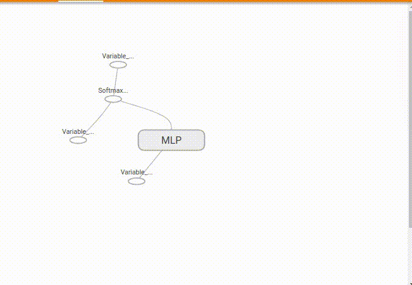

[](https://travis-ci.org/neka-nat/tensorboard-chainer)

[](https://badge.fury.io/py/tensorboard-chainer)

# tensorboard-chainer

Write tensorboard events with simple command.
including scalar, image, histogram, audio, text, graph and embedding.

This is based on [tensorboard-pytorch](https://github.com/lanpa/tensorboard-pytorch).

## Usage

Install tensorflow.

```
pip install tensorflow
```

Execute demo.py and tensorboard.
Access "localhost:6006" in your browser.

```
python demo.py
tensorboard --logdir runs
```

## Scalar example


## Histogram example


## Graph example



## Name scope

Like tensorflow, nodes in the graph can be grouped together in the namespace to make it easy to see.

```python
import chainer
import chainer.functions as F
import chainer.links as L
from tensorboard import name_scope

class MLP(chainer.Chain):
    def __init__(self, n_units, n_out):
        super(MLP, self).__init__()
        with self.init_scope():
            self.l1 = L.Linear(None, n_units)  # n_in -> n_units
            self.l2 = L.Linear(None, n_units)  # n_units -> n_units
            self.l3 = L.Linear(None, n_out)  # n_units -> n_out

    def __call__(self, x):
        with name_scope('linear1', self.l1.params()):
            h1 = F.relu(self.l1(x))
        with name_scope('linear2', self.l2.params()):
            h2 = F.relu(self.l2(h1))
        with name_scope('linear3', self.l3.params()):
            o = self.l3(h2)
        return o
```


## Reference

* https://github.com/lanpa/tensorboard-pytorch
* https://github.com/TeamHG-Memex/tensorboard_logger
* https://github.com/mitmul/tfchain